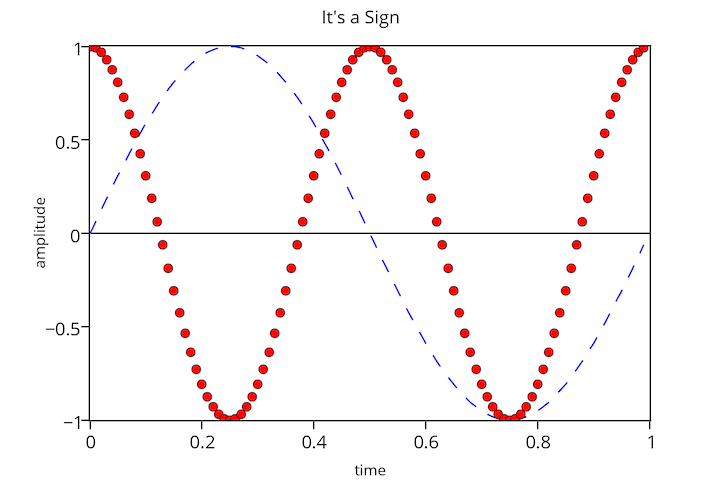
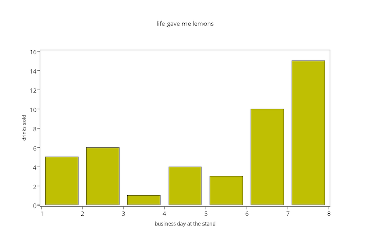
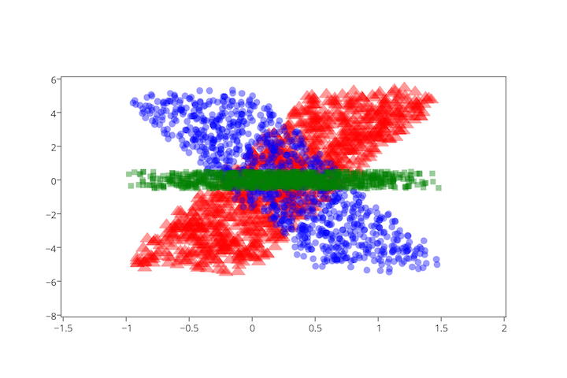
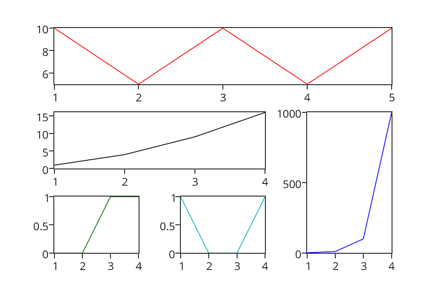
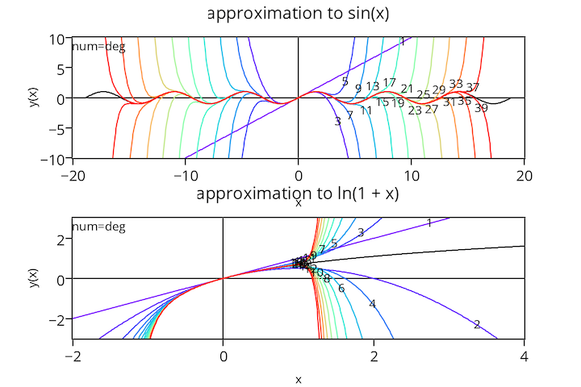

# matplotlylib:


### Sharing matplotlib figures online with plotly
-------------------------------------------------

About 
-----

[Plotly](https://plot.ly) is an online collaborative data analysis and graphing tool. The matplotlylib package allows users to export matplotlib figures to plotly. Plotly figures are shared, tracked, and edited all online and the data is always accessible from the graph. The goal of this project is to offer users a simple, one-liner to send a matplotlib figure to plotly from Python:

`fig_to_plotly(fig, username, api_key)`

That's it. Find out more, sign up, and start sharing by visiting us at [https://plot.ly](https://plot.ly/).

Install
-------
matplotlylib requires the [matplotlib](http://matplotlib.org)  and [plotly](https://github.com/plotly/python-api) Python packages.

This package is based on the [mplexporter](http://github.com/mpld3/mplexporter) framework for crawling and exporting matplotlib images. mplexporter is bundled with the source distribution via git submodule.

To get started you need to grab a copy of the matplotlylib repo. The makefile included in this is all you need to get setup. Just do the following:

```bash
$ make build
$ make install
```

The first instruction will grab mplexporter and move it into the matplotlylib directory.

The second instruction will install the matplotlylib package, which now has mplexporter built into it.

Gallery
-------
Check out the [IPython Notebook](http://nbviewer.ipython.org/github/mpld3/matplotlylib/blob/master/notebooks/Plotly%20and%20mpld3.ipynb), or have a look at our [plotly profile](https://plot.ly/~mpld3/) where you can open and edit all of the examples. If the NB is loading slowing, checkout our static site hosted on GitHub page at [http://plotly.github.io/matplotlylib/](http://plotly.github.io/matplotlylib/).

### Lines
---------
[](https://plot.ly/~mpld3/5)

### Bars
--------
[](https://plot.ly/~mpld3/8)

### Scatter
-----------
[](https://plot.ly/~mpld3/9)

### Subplots
------------
[](https://plot.ly/~mpld3/6)

### Annotations
---------------
[](https://plot.ly/~mpld3/7)

Details
-------
Created by: Plotly <matplotlylib@gmail.com>, [@plotlygraphs](https://twitter.com/plotlygraphs)

License: MIT
